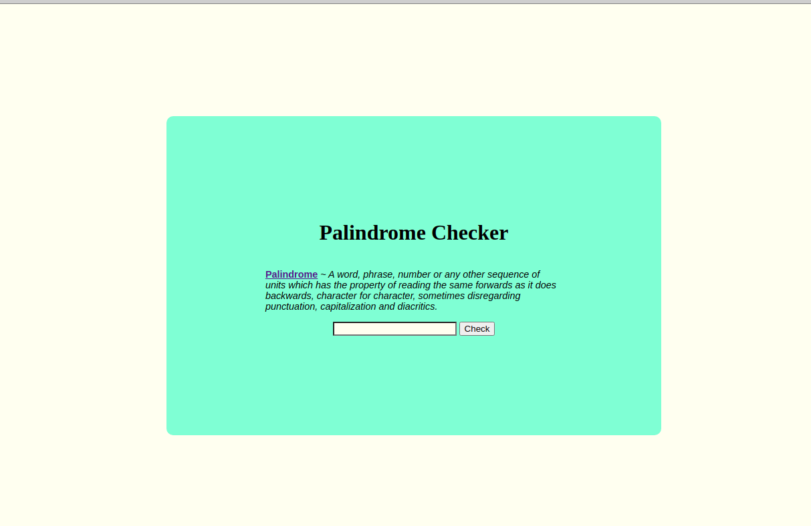

# Palindrome Checker

## Javascript Algorithms and Data Structures - Project 1
The palindrome checker takes a user's input and checks if it is a palindrome. Results are displayed when the check button is clicked.

### Screenshots

